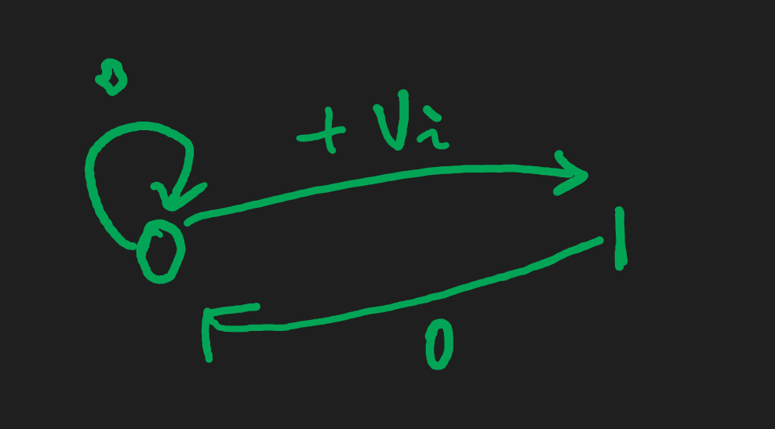
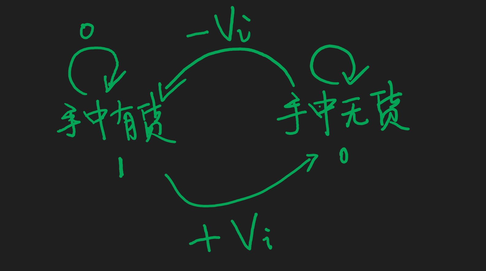
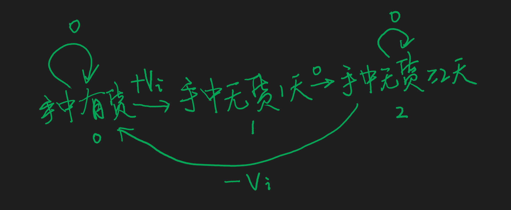

---
tags:
- DP
---
---

## AcWing 1049. 大盗阿福   [原题链接](https://www.acwing.com/problem/content/1051/)

阿福是一名经验丰富的大盗。趁着月黑风高，阿福打算今晚洗劫一条街上的店铺。

这条街上一共有 NN 家店铺，每家店中都有一些现金。

阿福事先调查得知，只有当他同时洗劫了两家相邻的店铺时，街上的报警系统才会启动，然后警察就会蜂拥而至。

作为一向谨慎作案的大盗，阿福不愿意冒着被警察追捕的风险行窃。

他想知道，在不惊动警察的情况下，他今晚最多可以得到多少现金？

#### 输入格式

输入的第一行是一个整数 TT，表示一共有 TT 组数据。

接下来的每组数据，第一行是一个整数 NN ，表示一共有 NN 家店铺。

第二行是 NN 个被空格分开的正整数，表示每一家店铺中的现金数量。

每家店铺中的现金数量均不超过1000。

#### 输出格式

对于每组数据，输出一行。

该行包含一个整数，表示阿福在不惊动警察的情况下可以得到的现金数量。

#### 数据范围

1≤T≤501≤T≤50,
1≤N≤1051≤N≤105

#### 输入样例：

```
2
3
1 8 2
4
10 7 6 14
```

#### 输出样例：

```
8
24
```

#### 样例解释

对于第一组样例，阿福选择第2家店铺行窃，获得的现金数量为8。

对于第二组样例，阿福选择第1和4家店铺行窃，获得的现金数量为10+14=24。

## 题目思路

$$
对于第i个房子，状态1：盗窃、状态0：不盗窃
$$

$$
状态机：
$$




$$
f(i,k):考虑前i个房子，第i个房子状态为k的方案中最大收益
$$

$$
f(i,0)=max(f(i-1,0),f(i-1,1))
$$

$$
f(i,1)=f(i-1,0)+V_i
$$

朴素写法：

```java
    private static void function1() {
        int t = in.nextInt();
        while (t-- > 0) {
            int n = in.nextInt();
            int[] arr = new int[n + 1];
            int[][] dp = new int[n + 1][2];
            for (int i = 1; i < n + 1; i++) arr[i] = in.nextInt();
            for (int i = 1; i < n + 1; i++) {
                dp[i][0] = Math.max(dp[i - 1][0], dp[i - 1][1]);
                dp[i][1] = dp[i - 1][0] + arr[i];
            }
            out.println(Math.max(dp[n][0], dp[n][1]));
        }
        out.flush();
        out.close();
    }

```

空间优化写法：

```java
    private static void function2() {
        int t = in.nextInt();
        while (t-- > 0) {
            int n = in.nextInt();
            int[] arr = new int[n + 1];
            int[] dp = new int[2];
            for (int i = 1; i < n + 1; i++) arr[i] = in.nextInt();
            for (int i = 0; i < n + 1; i++) {
                int temp = dp[0];
                dp[0] = Math.max(dp[0], dp[1]);
                dp[1] = temp + arr[i];
            }
            out.println(Math.max(dp[0], dp[1]));
        }
        out.flush();
        out.close();
    }

```

## AcWing 1057. 股票买卖 IV   [原题链接](https://www.acwing.com/problem/content/1059/)

给定一个长度为 NN 的数组，数组中的第 ii 个数字表示一个给定股票在第 ii 天的价格。

设计一个算法来计算你所能获取的最大利润，你最多可以完成 kk 笔交易。

注意：你不能同时参与多笔交易（你必须在再次购买前出售掉之前的股票）。一次买入卖出合为一笔交易。

#### 输入格式

第一行包含整数 NN 和 kk，表示数组的长度以及你可以完成的最大交易数量。

第二行包含 NN 个不超过 1000010000 的正整数，表示完整的数组。

#### 输出格式

输出一个整数，表示最大利润。

#### 数据范围

1≤N≤1051≤N≤105,
1≤k≤1001≤k≤100

#### 输入样例1：

```
3 2
2 4 1
```

#### 输出样例1：

```
2
```

#### 输入样例2：

```
6 2
3 2 6 5 0 3
```

#### 输出样例2：

```
7
```

#### 样例解释

样例1：在第 1 天 (股票价格 = 2) 的时候买入，在第 2 天 (股票价格 = 4) 的时候卖出，这笔交易所能获得利润 = 4-2 = 2 。

样例2：在第 2 天 (股票价格 = 2) 的时候买入，在第 3 天 (股票价格 = 6) 的时候卖出, 这笔交易所能获得利润 = 6-2 = 4 。随后，在第 5 天 (股票价格 = 0) 的时候买入，在第 6 天 (股票价格 = 3) 的时候卖出, 这笔交易所能获得利润 = 3-0 = 3 。共计利润 4+3 = 7.

## 题目思路


$$
f(i,j,k):考虑前i天，交易次数不超过j，手中货物状态为k的选法所获最大利益
$$

$$
我们定义时，买入时就算一次交易，卖出时就不算
$$

$$
f(i,j,0)=max(f(i-1,j,0),f(i-1,j,1)+V_i)
$$

$$
f(i,j,1)=max(f(i-1,j-1,0)-V_i,f(i-1,j,1))
$$

$$
初始化:
$$

$$
f(0,j,1)=-INF(刚开始一定没有股票)
$$

$$
f(i,0,1)=-INF(不经过交易无法获得股票)
$$

朴素写法：

```java
    private static void function1() {
        int n = in.nextInt();
        int m = in.nextInt();
        int[] arr = new int[n + 1];
        int[][][] dp = new int[n + 1][m + 1][2];
        for (int i = 0; i < n + 1; i++) dp[i][0][1] = Integer.MIN_VALUE;
        for (int j = 0; j < m + 1; j++) dp[0][j][1] = Integer.MIN_VALUE;
        for (int i = 1; i < n + 1; i++) arr[i] = in.nextInt();
        for (int i = 1; i < n + 1; i++) {
            for (int j = 1; j < m + 1; j++) {
                dp[i][j][0] = Math.max(dp[i - 1][j][0], dp[i - 1][j][1] + arr[i]);
                dp[i][j][1] = Math.max(dp[i - 1][j - 1][0] - arr[i], dp[i - 1][j][1]);
            }
        }
        out.println(dp[n][m][0]);
        out.flush();
        out.close();
    }

```

空间优化写法:

```java
    private static void function2() {
        int n = in.nextInt();
        int m = in.nextInt();
        int[] arr = new int[n + 1];
        int[][] dp = new int[m + 1][2];
        dp[0][1] = Integer.MIN_VALUE;
        for (int j = 0; j < m + 1; j++) dp[j][1] = Integer.MIN_VALUE;
        for (int i = 1; i < n + 1; i++) arr[i] = in.nextInt();
        for (int i = 1; i < n + 1; i++) {
            for (int j = m; j >= 1; j--) {
                dp[j][0] = Math.max(dp[j][0], dp[j][1] + arr[i]);
                dp[j][1] = Math.max(dp[j - 1][0] - arr[i], dp[j][1]);
            }
        }
        out.println(dp[m][0]);
        out.flush();
        out.close();
    }
```

## AcWing 1058. 股票买卖 V   [原题链接](https://www.acwing.com/problem/content/1060/)

给定一个长度为 NN 的数组，数组中的第 ii 个数字表示一个给定股票在第 ii 天的价格。

设计一个算法计算出最大利润。在满足以下约束条件下，你可以尽可能地完成更多的交易（多次买卖一支股票）:

- 你不能同时参与多笔交易（你必须在再次购买前出售掉之前的股票）。
- 卖出股票后，你无法在第二天买入股票 (即冷冻期为 11 天)。

#### 输入格式

第一行包含整数 NN，表示数组长度。

第二行包含 NN 个不超过 1000010000 的正整数，表示完整的数组。

#### 输出格式

输出一个整数，表示最大利润。

#### 数据范围

1≤N≤1051≤N≤105

#### 输入样例：

```
5
1 2 3 0 2
```

#### 输出样例：

```
3
```

#### 样例解释

对应的交易状态为: [买入, 卖出, 冷冻期, 买入, 卖出]，第一笔交易可得利润 2-1 = 1，第二笔交易可得利润 2-0 = 2，共得利润 1+2 = 3。

## 题目思路


$$
f(i,k):考虑前i天，手中货物状态为k的方案中获利最大值
$$

$$
f(i,0)=max(f(i-1,0),f(i-1,2)-V_i)
$$

$$
f(i,1)=f(i-1,0)+V_i
$$

$$
f(i,2)=max(f(i-1,2),f(i-1,1))
$$

$$
初始化：
$$

$$
f(0,0)=f(0,1)=-INF(刚开始不会有货，也不算无货1天)
$$

朴素写法:

```java
    private static void function1() {
        int n = in.nextInt();
        int[] arr = new int[n + 1];
        int[][] dp = new int[n + 1][3];
        dp[0][0] = dp[0][1] = Integer.MIN_VALUE;
        for (int i = 1; i < n + 1; i++) arr[i] = in.nextInt();
        for (int i = 1; i < n + 1; i++) {
            dp[i][0] = Math.max(dp[i - 1][0], dp[i - 1][2] - arr[i]);
            dp[i][1] = dp[i - 1][0] + arr[i];
            dp[i][2] = Math.max(dp[i - 1][2], dp[i - 1][1]);
        }
        out.println(Math.max(dp[n][1], dp[n][2]));
        out.flush();
        out.close();
    }
```

空间优化写法:

```java
    private static void function2() {
        int n = in.nextInt();
        int[] arr = new int[n + 1];
        int[] dp = new int[3];
        dp[0] = dp[1] = Integer.MIN_VALUE;
        for (int i = 1; i < n + 1; i++) arr[i] = in.nextInt();
        for (int i = 1; i < n + 1; i++) {
            int t0 = dp[0];
            int t1 = dp[1];
            dp[0] = Math.max(dp[0], dp[2] - arr[i]);
            dp[1] = t0 + arr[i];
            dp[2] = Math.max(dp[2], t1);
        }
        out.println(Math.max(dp[1], dp[2]));
        out.flush();
        out.close();
    }
```

## AcWing 1052. 设计密码   [原题链接](https://www.acwing.com/problem/content/1054/)

你现在需要设计一个密码 SS，SS 需要满足：

- SS 的长度是 NN；
- SS 只包含小写英文字母；
- SS 不包含子串 TT；

例如：abcabc 和 abcdeabcde 是 abcdeabcde 的子串，abdabd 不是 abcdeabcde 的子串。

请问共有多少种不同的密码满足要求？

由于答案会非常大，请输出答案模 109+7109+7 的余数。

#### 输入格式

第一行输入整数N，表示密码的长度。

第二行输入字符串T，T中只包含小写字母。

#### 输出格式

输出一个**正整数**，表示总方案数模 109+7109+7 后的结果。

#### 数据范围

1≤N≤501≤N≤50,
1≤|T|≤N1≤|T|≤N，|T||T|是TT的长度。

#### 输入样例1：

```
2
a
```

#### 输出样例1：

```
625
```

#### 输入样例2：

```
4
cbc
```

#### 输出样例2：

```
456924
```

## 题目思路
先复习一下KMP相关知识：[[KMP]]

$$
f(i,u)表示的是在长度为 i 的的所有字符串中使得我们的模式串最终停留在位置 u 的字符串总数
$$

$$
f(i,u)是由长度为 i-1 的字符串中那些下一次匹配可以转移到 u 的位置所转移过来的
$$

$$
预处理函数g(j,c)代表当模式串位置在 j 时并且当前主串为字母 c 的时候下一次会转移到的位置
$$

```java
   private static int[] getNextArray(char[] cs) {
        int[] next = new int[cs.length];
        for (int i = 2, j = 0; i < cs.length; i++) {
            while (j != 0 && cs[i] != cs[j + 1]) {
                j = next[j];
            }
            if (cs[i] == cs[j + 1]) {
                j++;
            }
            next[i] = j;
        }
        return next;
    }
    private static int[][] initTable(String str) {
        int m = str.length();
        char[] cs = new char[m + 1];
        int[][] table = new int[m + 1][26];
        System.arraycopy(str.toCharArray(), 0, cs, 1, m);
        int[] nextArray = getNextArray(cs);
        //
        for (int i = 0; i < m; i++) {
            for (char k = 'a'; k <= 'z'; k++) {
                int j = i;
                while (j != 0 && cs[j + 1] != k) j = nextArray[j];
                if (cs[j + 1] == k) j++;
                table[i][k - 'a'] = j;
            }
        }
        return table;
    }
    public static void main(String[] args) {
        int n = in.nextInt();
        String str = in.next();
        int m = str.length();
        final int MOD = (int)(1e9 + 7);
        int[][] table = initTable(str);
        int[][] dp = new int[n + 1][m + 1];
        dp[0][0] = 1;
        for (int i = 1; i <= n; i++) {
            for (char k = 'a'; k <= 'z'; k++) {
                for (int j = 0; j <= m; j++) {
                    int u = table[j][k - 'a'];
                    if (u < m) dp[i][u] = (dp[i][u] + dp[i - 1][j]) % MOD;
                }
            }
        }
        int res = 0;
        for (int i = 0; i <= m; i++) res = (res + dp[n][i]) % MOD;
        out.println(res);
        out.flush();
        out.close();
    }
```

## [1053. 修复DNA](https://www.acwing.com/problem/content/description/1055/)
生物学家终于发明了修复DNA的技术，能够将包含各种遗传疾病的DNA片段进行修复。

为了简单起见，DNA看作是一个由’A’, ‘G’ , ‘C’ , ‘T’构成的字符串。

修复技术就是通过改变字符串中的一些字符，从而消除字符串中包含的致病片段。

例如，我们可以通过改变两个字符，将DNA片段”AAGCAG”变为”AGGCAC”，从而使得DNA片段中不再包含致病片段”AAG”，”AGC”，”CAG”，以达到修复该DNA片段的目的。

需注意，被修复的DNA片段中，仍然只能包含字符’A’, ‘G’ , ‘C’ , ‘T’。

请你帮助生物学家修复给定的DNA片段，并且修复过程中改变的字符数量要尽可能的少。

#### 输入格式

输入包含多组测试数据。

每组数据第一行包含整数N，表示致病DNA片段的数量。

接下来N行，每行包含一个长度不超过20的非空字符串，字符串中仅包含字符’A’, ‘G’ , ‘C’ , ‘T’，用以表示致病DNA片段。

再一行，包含一个长度不超过1000的非空字符串，字符串中仅包含字符’A’, ‘G’ , ‘C’ , ‘T’，用以表示待修复DNA片段。

最后一组测试数据后面跟一行，包含一个0，表示输入结束。

#### 输出格式

每组数据输出一个结果，每个结果占一行。

输入形如”Case x: y”，其中x为测试数据编号（从1开始），y为修复过程中所需改变的字符数量的最小值，如果无法修复给定DNA片段，则y为”-1”。

#### 数据范围

1≤N≤501≤N≤50

#### 输入样例：

```
2
AAA
AAG
AAAG    
2
A
TG
TGAATG
4
A
G
C
T
AGT
0
```

#### 输出样例：

```
Case 1: 1
Case 2: 4
Case 3: -1
```