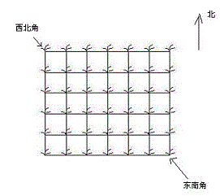
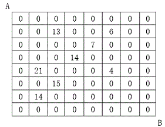

# 数字三角形模型

## AcWing 1015. 摘花生   [原题链接](https://www.acwing.com/problem/content/1017/)

Hello Kitty想摘点花生送给她喜欢的米老鼠。

她来到一片有网格状道路的矩形花生地(如下图)，从西北角进去，东南角出来。

地里每个道路的交叉点上都有种着一株花生苗，上面有若干颗花生，经过一株花生苗就能摘走该它上面所有的花生。

Hello Kitty只能向东或向南走，不能向西或向北走。

问Hello Kitty最多能够摘到多少颗花生。



#### 输入格式

第一行是一个整数T，代表一共有多少组数据。

接下来是T组数据。

每组数据的第一行是两个整数，分别代表花生苗的行数R和列数 C。

每组数据的接下来R行数据，从北向南依次描述每行花生苗的情况。每行数据有C个整数，按从西向东的顺序描述了该行每株花生苗上的花生数目M。

#### 输出格式

对每组输入数据，输出一行，内容为Hello Kitty能摘到得最多的花生颗数。

#### 数据范围

1≤T≤1001≤T≤100,
1≤R,C≤1001≤R,C≤100,
0≤M≤10000≤M≤1000

#### 输入样例：

```
2
2 2
1 1
3 4
2 3
2 3 4
1 6 5
```

#### 输出样例：

```
8
16
```

## 题目思路

$$
f(i,j):所有从点(1,1)走到(i,j)的路线，所摘花生的最大数量
$$

$$
设i,j点花生数量为number_{ij}:f(i,j) = max(f(i-1,j), f(i,j-1))+number_{ij}
$$

```java
    public static void main(String[] args) {
        int m = in.nextInt();
        while (m-- > 0) {
            int row = in.nextInt();
            int col = in.nextInt();
            int[][] arr = new int[row][col];
            for (int i = 0; i < row; i++) {
                for (int j = 0; j < col; j++) {
                    arr[i][j] = in.nextInt();
                }
            }
            int[][] dp = new int[row + 1][col + 1];
            for (int i = 1; i < row + 1; i++) {
                for (int j = 1; j < col + 1; j++) {
                    dp[i][j] = Math.max(dp[i - 1][j], dp[i][j - 1]) + arr[i - 1][j - 1];
                }
            }
            out.println(dp[row][col]);
        }
        out.flush();
        out.close();
    }
```

## AcWing 1018. 最低通行费   [原题链接](https://www.acwing.com/problem/content/1020/)

一个商人穿过一个N×N的正方形的网格，去参加一个非常重要的商务活动。

他要从网格的左上角进，右下角出。

每穿越中间1个小方格，都要花费1个单位时间。

商人必须在(2N-1)个单位时间穿越出去。

而在经过中间的每个小方格时，都需要缴纳一定的费用。

这个商人期望在规定时间内用最少费用穿越出去。

请问至少需要多少费用？

注意：不能对角穿越各个小方格（即，只能向上下左右四个方向移动且不能离开网格）。

#### 输入格式

第一行是一个整数，表示正方形的宽度N。

后面N行，每行N个不大于100的整数，为网格上每个小方格的费用。

#### 输出格式

输出一个整数，表示至少需要的费用。

#### 数据范围

1≤N≤1001≤N≤100

#### 输入样例：

```
5
1  4  6  8  10 
2  5  7  15 17 
6  8  9  18 20 
10 11 12 19 21 
20 23 25 29 33
```

#### 输出样例：

```
109
```

#### 样例解释

样例中，最小值为109=1+2+5+7+9+12+19+21+33。

## 题目思路

$$
依题意可知：商人不能走回头路
$$

$$
f(i,j):所有从(1,1)走到(i,j)的路径中所用的最小费用
$$

$$
f(i,j)=max(f(i-1,j),f(i,j-1))+cost_{ij}
$$

```java
    public static void main(String[] args) {
        int n = in.nextInt();
        int[][] arr = new int[n][n];
        for (int i = 0; i < n; i++) {
            for (int j = 0; j < n; j++) {
                arr[i][j] = in.nextInt();
            }
        }
        int[][] dp = new int[n + 1][n + 1];
        for (int i = 0; i < n + 1; i++) {
            Arrays.fill(dp[i], Integer.MAX_VALUE);
        }
        dp[0][1] = dp[1][0] = 0;
        for (int i = 1; i < n + 1; i++) {
            for (int j = 1; j < n + 1; j++) {
                dp[i][j] = Math.min(dp[i - 1][j], dp[i][j - 1]) + arr[i - 1][j - 1];
            }
        }
        out.println(dp[n][n]);
        out.flush();
        out.close();
    }
```

## AcWing 1027. 方格取数   [原题链接](https://www.acwing.com/problem/content/1029/)

设有 N×N 的方格图，我们在其中的某些方格中填入正整数，而其它的方格中则放入数字0。如下图所示：



某人从图中的左上角 A 出发，可以向下行走，也可以向右行走，直到到达右下角的 B 点。

在走过的路上，他可以取走方格中的数（取走后的方格中将变为数字0）。

此人从 A 点到 B 点共走了两次，试找出两条这样的路径，使得取得的数字和为最大。

#### 输入格式

第一行为一个整数N，表示 N×N 的方格图。

接下来的每行有三个整数，第一个为行号数，第二个为列号数，第三个为在该行、该列上所放的数。

行和列编号从 11 开始。

一行“0 0 0”表示结束。

#### 输出格式

输出一个整数，表示两条路径上取得的最大的和。

#### 数据范围

N≤10N≤10

#### 输入样例：

```
8
2 3 13
2 6 6
3 5 7
4 4 14
5 2 21
5 6 4
6 3 15
7 2 14
0 0 0
```

#### 输出样例：

```
67
```

## 题目思路

与题目AcWing 1015. 摘花生   [原题链接](https://www.acwing.com/problem/content/1017/)，区别就是要走两次
$$
f(i_1,j_1,i_2,j_2)表示所有从(1,1),(1,1)分别走到(i_1,j_1),(i_2,j_2)的路径的最大值
$$

$$
我们需要保证这两条路线同一个格子不能重复选择
$$

$$
设k=i_1+j_1=i_2+j_2,则状态可以改为：
$$

$$
f(k,i_1,i_2)表示所有从(1,1),(1,1)分别走到(i_1,k-i_1),(i_2,k-i_2)的路径的最大值
$$

$$
设w_{ij}为(i,j)的数值
$$

$$
若两条路都是从上往下走：
$$

$$
第一条路径:(1,1)到(i_1-1,j_1)到(i_1,j_1)
$$

$$
第二条路径:(1,1)到(i_2-1,j_2)到(i_2,j_2)
$$

$$
要两者的路径和为最大值，就是取(1,1)到(i_1-1,j_1)和(1,1)到(i_2-1,j_2)路径和最大值
$$

$$
即f(k-1,i_1-1,i_2-1)+
\begin{cases}
w_{i_1j_1}(两点重合)
\\
w_{i_1j_2}+w_{i_2j_2}(两点不重合)
\end{cases}\tag1
$$

$$
同理：
$$

$$
第一条走下，第二条走右有:
$$

$$
f(k-1,i_1-1,i_2)+
\begin{cases}
w_{i_1j_1}(两点重合)
\\
w_{i_1j_2}+w_{i_2j_2}(两点不重合)
\end{cases}\tag2
$$

$$
第一条走右，第二条走下有：
$$

$$
f(k-1,i_1,i_2-1)+
\begin{cases}
w_{i_1j_1}(两点重合)
\\
w_{i_1j_2}+w_{i_2j_2}(两点不重合)
\end{cases}\tag3
$$

$$
第一条走右，第二条走右有
$$

$$
f(k-1,i_1,i_2)+
\begin{cases}
w_{i_1j_1}(两点重合)
\\
w_{i_1j_2}+w_{i_2j_2}(两点不重合)
\end{cases}\tag4
$$

$$
f(k,i_1,i_2)=max((1),(2),(3),(4))
$$

```java
    public static void main(String[] args) {
        int n = in.nextInt();
        int[][] arr = new int[n + 1][n + 1];
        int row;
        int col;
        int val;
        row = in.nextInt();col = in.nextInt();val = in.nextInt();
        while (row != 0 || col != 0 || val != 0) {
            arr[row][col] = val;
            row = in.nextInt();col = in.nextInt();val = in.nextInt();
        }
        int[][][] dp = new int[2 * n + 1][n + 1][n + 1];
        for (int k = 2; k < 2 * n + 1; k++) {
            for (int i = 1; i < n + 1; i++) {
                for (int i2 = 1; i2 < n + 1; i2++) {
                    int j = k - i;
                    int j2 = k - i2;
                    if (j >= 1 && j <= n && j2 >= 1 && j2 <= n) {
                        int add = arr[i][j];
                        if (i != i2) add += arr[i2][j2];
                        dp[k][i][i2] = Math.max(dp[k][i][i2], dp[k - 1][i - 1][i2 - 1] + add);
                        dp[k][i][i2] = Math.max(dp[k][i][i2], dp[k - 1][i][i2 - 1] + add);
                        dp[k][i][i2] = Math.max(dp[k][i][i2], dp[k - 1][i - 1][i2] + add);
                        dp[k][i][i2] = Math.max(dp[k][i][i2], dp[k - 1][i][i2] + add);
                    }
                }
            }
        }
        out.println(dp[2 * n][n][n]);
        out.flush();
        out.close();
    }
```

## AcWing 275. 传纸条   [原题链接](https://www.acwing.com/problem/content/277/)

小渊和小轩是好朋友也是同班同学，他们在一起总有谈不完的话题。

一次素质拓展活动中，班上同学安排坐成一个 mm 行 nn 列的矩阵，而小渊和小轩被安排在矩阵对角线的两端，因此，他们就无法直接交谈了。

幸运的是，他们可以通过传纸条来进行交流。

纸条要经由许多同学传到对方手里，小渊坐在矩阵的左上角，坐标(1,1)，小轩坐在矩阵的右下角，坐标(m,n)。

从小渊传到小轩的纸条只可以向下或者向右传递，从小轩传给小渊的纸条只可以向上或者向左传递。 

在活动进行中，小渊希望给小轩传递一张纸条，同时希望小轩给他回复。

班里每个同学都可以帮他们传递，但只会帮他们一次，也就是说如果此人在小渊递给小轩纸条的时候帮忙，那么在小轩递给小渊的时候就不会再帮忙，反之亦然。 

还有一件事情需要注意，全班每个同学愿意帮忙的好感度有高有低（注意：小渊和小轩的好心程度没有定义，输入时用0表示），可以用一个0-100的自然数来表示，数越大表示越好心。

小渊和小轩希望尽可能找好心程度高的同学来帮忙传纸条，即找到来回两条传递路径，使得这两条路径上同学的好心程度之和最大。

现在，请你帮助小渊和小轩找到这样的两条路径。

#### 输入格式

第一行有2个用空格隔开的整数 mm 和 nn，表示学生矩阵有 mm 行 nn 列。

接下来的 mm 行是一个 m∗nm∗n 的矩阵，矩阵中第 ii 行 jj 列的整数表示坐在第 ii 行 jj 列的学生的好心程度，每行的 nn 个整数之间用空格隔开。

#### 输出格式

输出一个整数，表示来回两条路上参与传递纸条的学生的好心程度之和的最大值。

#### 数据范围

1≤n,m≤501≤n,m≤50

#### 输入样例：

```
3 3
0 3 9
2 8 5
5 7 0
```

#### 输出样例：

```
34
```

```java
    public static void main(String[] args) {
        int n = in.nextInt();
        int m = in.nextInt();
        int[][] arr = new int[n + 1][m + 1];
        for (int i = 1; i < n + 1; i++)
            for (int j = 1; j < m + 1; j++) {
                arr[i][j] = in.nextInt();
            }
        int[][][] dp = new int[n + m + 1][n + 1][n + 1];
        for (int k = 2; k < n + m + 1; k++) {
            for (int i = 1; i < n + 1; i++) {
                for (int i2 = 1; i2 < n + 1; i2++) {
                    int j = k - i;
                    int j2 = k - i2;
                    if (j >= 1 && j <= m && j2 >= 1 && j2 <= m) {
                        int add = arr[i][j];
                        if (i != i2) add += arr[i2][j2];
                        dp[k][i][i2] = Math.max(dp[k][i][i2], dp[k - 1][i - 1][i2 - 1] + add);
                        dp[k][i][i2] = Math.max(dp[k][i][i2], dp[k - 1][i][i2 - 1] + add);
                        dp[k][i][i2] = Math.max(dp[k][i][i2], dp[k - 1][i - 1][i2] + add);
                        dp[k][i][i2] = Math.max(dp[k][i][i2], dp[k - 1][i][i2] + add);
                    }
                }
            }
        }
        out.println(dp[n + m][n][n]);
        out.flush();
        out.close();
    }
```

